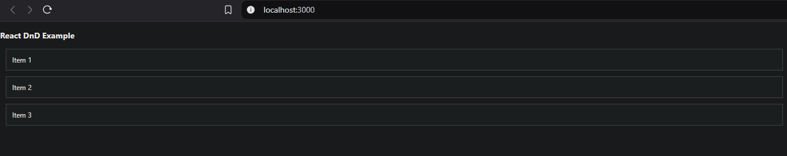
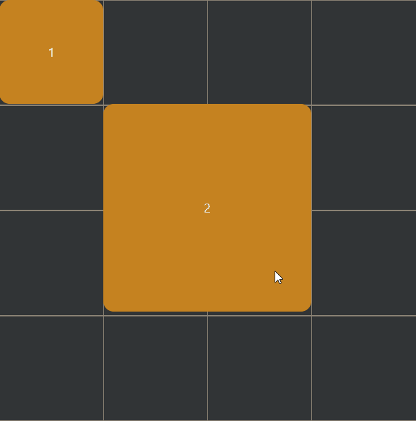
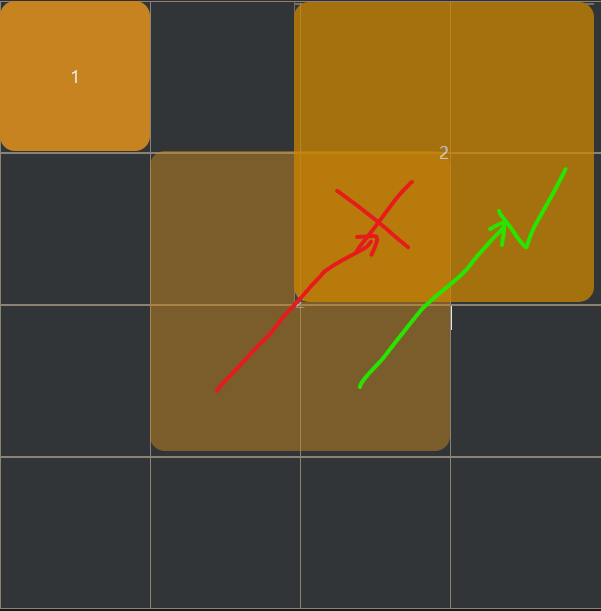

# Game_interface
Creating an interface for the inventory, to learn how to deal with drag&amp;drop items.
This also can be used as an integrated module for a web-game in the future, or you can change it a bit to create something better to use in another project.

### Links
Here you can check how everything looks like and how it was made. Code is changing step by step, so maybe savings of "old" code versions and solved problems will help you too.
- [Result](#result)
- [Development](#development)
- [Problems](#problems)

### How to install and run the project?

! not finished


## Result

! not finished

## Development
### Step one
We will start by just creating list of items we can drag and drop on another item's place. 
For now can place the item into different id drop point and other components in the list will just move once up or down.

For example : 1,2,3 -> drag 1 to the third place -> 2,3,1.

#### Example


#### Code Part
``` js
const DraggableItem = ({ id, text, moveItem }) => {
  const [{ isDragging }, drag] = useDrag({
    type: ItemType,
    item: { id },
    collect: (monitor) => ({
      isDragging: monitor.isDragging(),
    }),
  });

  const [, drop] = useDrop({
    accept: ItemType,
    hover: (draggedItem) => {
      if (draggedItem.id !== id) {
        moveItem(draggedItem.id, id);
        draggedItem.id = id;
      }
    },
  });

  return(...);
};
```
``` js
const moveItem = (fromId, toId) => {
    const fromIndex = items.findIndex((item) => item.id === fromId);
    const toIndex = items.findIndex((item) => item.id === toId);
    const updatedItems = [...items];
    const [movedItem] = updatedItems.splice(fromIndex, 1);
    updatedItems.splice(toIndex, 0, movedItem);
    setItems(updatedItems);
};
```

## Step two
Now we move from the list to the grid.
It is nothing special, but 4x4 matrix were you can place  1x1 and 2x2 items and move them inside of it for now.

#### Example 



#### Code Part

Completely changing the code for the draggable item and adding **offsets** for both grid and item to control what and where are we picking to move, and where do we want to drop it:

``` js
const [{ isDragging }, dragRef] = useDrag({
    type: 'ITEM',
    item: (monitor) => {
      const clientOffset = monitor.getInitialClientOffset();
      const sourceOffset = monitor.getInitialSourceClientOffset();

      let offsetX = 0;
      let offsetY = 0;

      if (clientOffset && sourceOffset) {
        offsetX = clientOffset.x - sourceOffset.x;
        offsetY = clientOffset.y - sourceOffset.y;
      }
    
      return { ...item, offsetX, offsetY };
    },
    collect: (monitor) => ({
      isDragging: !!monitor.isDragging(),
    }),
});
```

``` js
const GridCell = ({ x, y, size, items, setItems }) => {
  const [{ isOver }, dropRef] = useDrop({
    accept: 'ITEM',
    canDrop: (item) => canPlaceItem(item, x, y, size, items, item.offsetX, item.offsetY),
    drop: (item) => moveItem(item, x, y, setItems, item.offsetX, item.offsetY),
    collect: (monitor) => ({
      isOver: !!monitor.isOver(),
    }),
  });

  return ( ... );
};
```
We also should pay attention to the movement control int the grid, so that it considers the stored offsets when calculating the new grid position.

Adjusted Coordinates: _adjustedX_ and _adjustedY_ are calculated by subtracting the offset (converted to grid cells) from the drop location.


Placement: Both _canPlaceItem_ and _moveItem_ use these adjusted coordinates, so the item will drop in the correct grid location based on the part of it that was initially grabbed.

``` js
const canPlaceItem = (item, x, y, size, items, offsetX, offsetY) => {
  const GRID_SIZE = size;
  const adjustedX = x - Math.floor(offsetX / 100);
  const adjustedY = y - Math.floor(offsetY / 100);

  for (let i = 0; i < item.width; i++) {
    for (let j = 0; j < item.height; j++) {
      if (
        adjustedX + i >= GRID_SIZE ||
        adjustedY + j >= GRID_SIZE ||
        adjustedX + i < 0 ||
        adjustedY + j < 0 ||
        items.some(
          (otherItem) =>
            otherItem.id !== item.id &&
            adjustedX + i >= otherItem.x &&
            adjustedX + i < otherItem.x + otherItem.width &&
            adjustedY + j >= otherItem.y &&
            adjustedY + j < otherItem.y + otherItem.height
        )
      ) {
        return false;
      }
    }
  }
  return true;
};

const moveItem = (item, x, y, setItems, offsetX, offsetY) => {
  const adjustedX = x - Math.floor(offsetX / 100);
  const adjustedY = y - Math.floor(offsetY / 100);

  setItems((prevItems) =>
    prevItems.map((i) =>
      i.id === item.id ? { ...i, x: adjustedX, y: adjustedY } : i
    )
  );
};
```

## Problems

- [ ] <08.11.24> - I can't move 2x2 item by toggling it from (1,1) coordinates to (2,2), because it is the place this item using rn. I can drop it to the next cell and cross the previous border only if I dragged it with the part, which doesn't cross previous position. 
